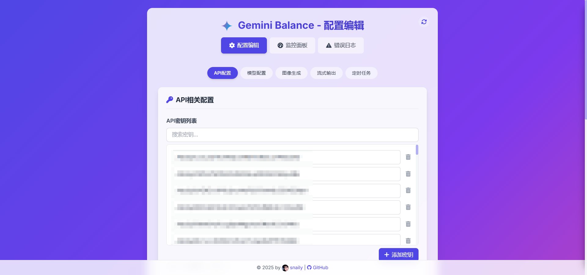
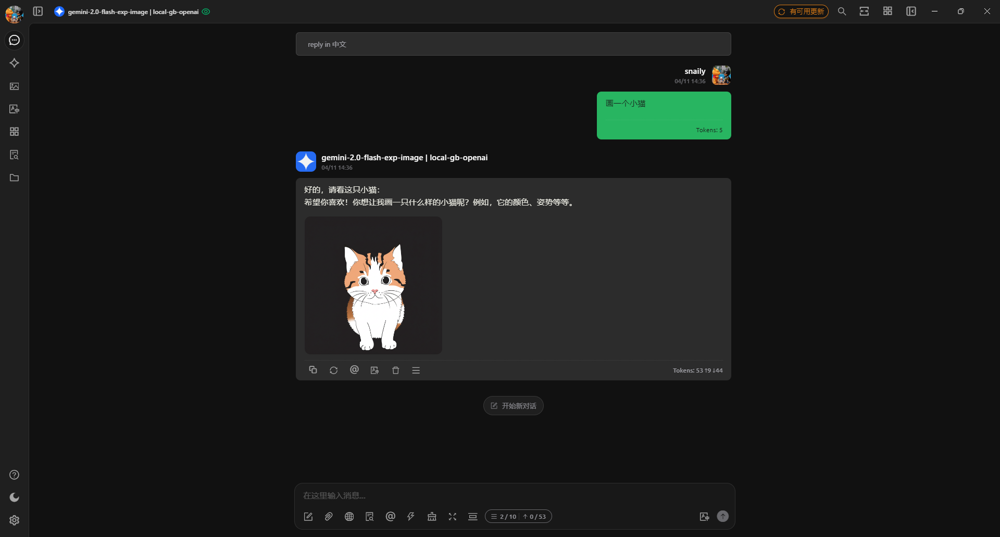
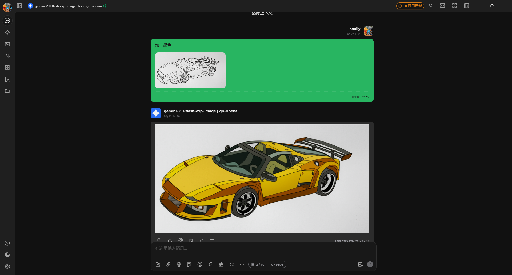
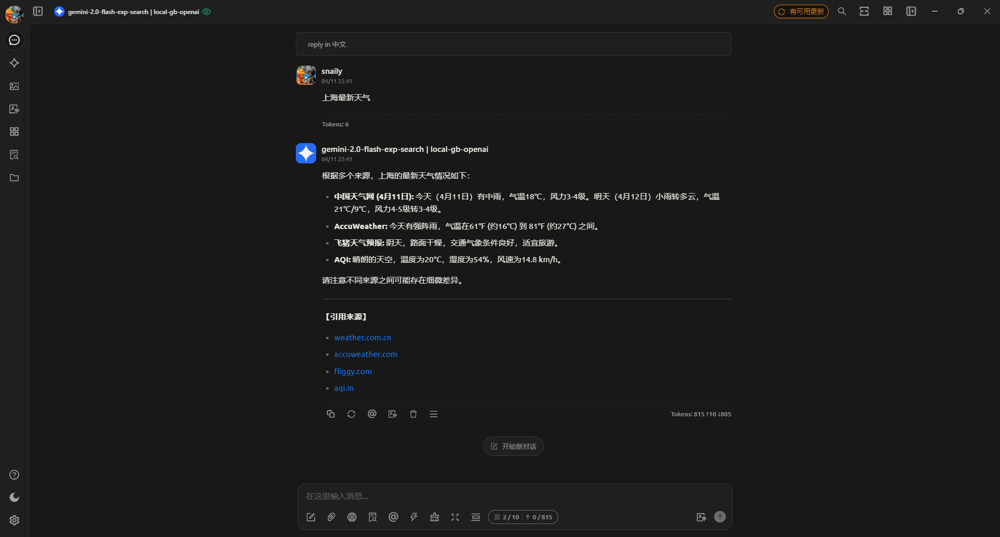
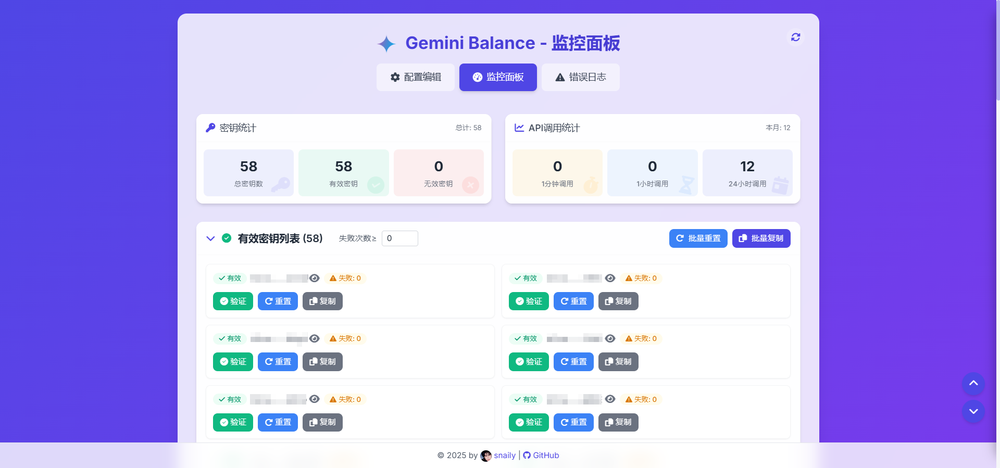
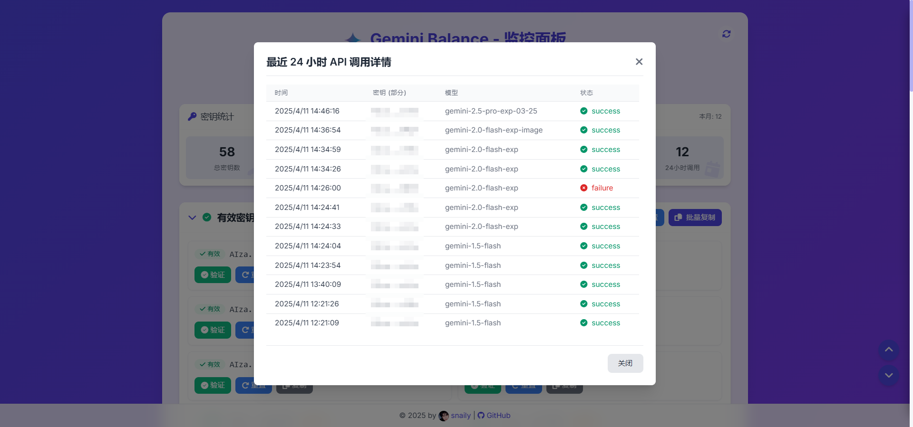
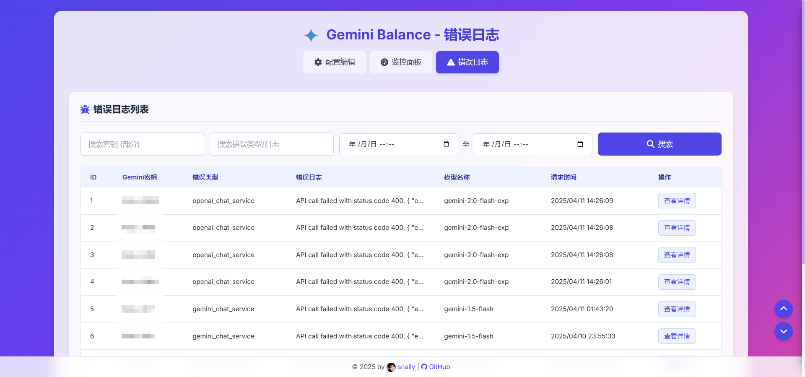
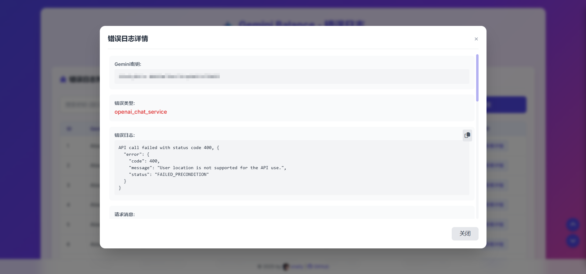
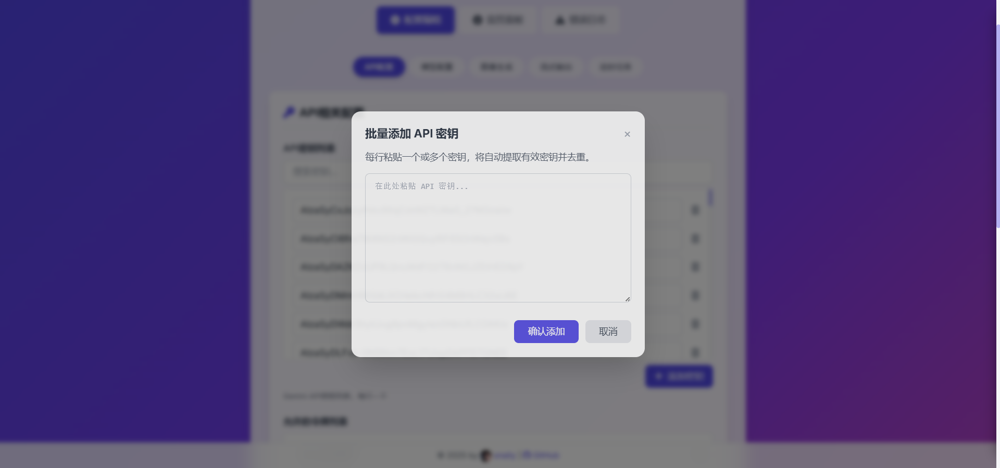

[Read this document in Chinese](README_ZH.md)

# Gemini Balance - Gemini API Proxy and Load Balancer

<p align="center">
  <a href="https://trendshift.io/repositories/13692" target="_blank">
    
  </a>
</p>

<p align="center">
  <a href="https://www.python.org/"></a>
  <a href="https://fastapi.tiangolo.com/"></a>
  <a href="https://www.uvicorn.org/"></a>
  <a href="https://t.me/+soaHax5lyI0wZDVl"></a>
</p>

> ⚠️ **Important**: This project is licensed under the [CC BY-NC 4.0](LICENSE) license. **Any form of commercial resale service is prohibited**.
> I have never sold this service on any platform. If you encounter someone selling this service, they are a reseller. Please do not be deceived.

---

## 📖 Project Introduction

**Gemini Balance** is an application built with Python FastAPI, designed to provide proxy and load balancing functions for the Google Gemini API. It allows you to manage multiple Gemini API Keys and implement key rotation, authentication, model filtering, and status monitoring through simple configuration. Additionally, the project integrates image generation and multiple image hosting upload functions, and supports proxying in the OpenAI API format.

<details>
<summary>📂 View Project Structure</summary>

```plaintext
app/
├── config/       # Configuration management
├── core/         # Core application logic (FastAPI instance creation, middleware, etc.)
├── database/     # Database models and connections
├── domain/       # Business domain objects
├── exception/    # Custom exceptions
├── handler/      # Request handlers
├── log/          # Logging configuration
├── main.py       # Application entry point
├── middleware/   # FastAPI middleware
├── router/       # API routes (Gemini, OpenAI, status page, etc.)
├── scheduler/    # Scheduled tasks (e.g., Key status check)
├── service/      # Business logic services (chat, Key management, statistics, etc.)
├── static/       # Static files (CSS, JS)
├── templates/    # HTML templates (e.g., Key status page)
└── utils/        # Utility functions
```
</details>

---

## ✨ Feature Highlights

*   **Multi-Key Load Balancing**: Supports configuring multiple Gemini API Keys (`API_KEYS`) for automatic sequential polling.
*   **Visual Configuration**: Configurations modified through the admin backend take effect immediately without restarting.
    
*   **Dual Protocol API Compatibility**: Supports both Gemini and OpenAI CHAT API formats.
    *   OpenAI Base URL: `http://localhost:8000(/hf)/v1`
    *   Gemini Base URL: `http://localhost:8000(/gemini)/v1beta`
*   **Image-Text Chat & Modification**: Configure models with `IMAGE_MODELS` to support image-text chat and editing. Use the `configured_model-image` model name to invoke.
    
    
*   **Web Search**: Configure models with `SEARCH_MODELS` to support web search. Use the `configured_model-search` model name to invoke.
    
*   **Key Status Monitoring**: Provides a `/keys_status` page (authentication required) for real-time monitoring.
    
*   **Detailed Logging**: Provides detailed error logs for easy troubleshooting.
    
    
    
*   **Flexible Key Addition**: Add keys in batches using the `gemini_key` regex, with automatic deduplication.
    
*   **Failure Retry & Auto-Disable**: Automatically retries failed API requests (`MAX_RETRIES`) and disables keys after excessive failures (`MAX_FAILURES`).
*   **Comprehensive API Compatibility**:
    *   **Embeddings API**: Fully compatible with the OpenAI `embeddings` API format.
    *   **Image Generation API**: Adapts the `imagen-3.0-generate-002` model to the OpenAI image generation API format.
*   **Automatic Model List Maintenance**: Automatically fetches and syncs the latest model lists from Gemini and OpenAI.
*   **Proxy Support**: Supports HTTP/SOCKS5 proxies (`PROXIES`).
*   **Docker Support**: Provides Docker images for both AMD and ARM architectures.
    *   Image Address: `ghcr.io/snailyp/gemini-balance:latest`

---

## 🚀 Quick Start

### Option 1: Docker Compose (Recommended)

1.  **Get `docker-compose.yml`**:
    Download the `docker-compose.yml` file from the project repository.
2.  **Prepare `.env` file**:
    Copy `.env.example` to `.env` and configure it. Ensure `DATABASE_TYPE` is set to `mysql` and fill in the `MYSQL_*` details.
3.  **Start Services**:
    In the directory containing `docker-compose.yml` and `.env`, run:
    ```bash
    docker-compose up -d
    ```

### Option 2: Docker Command

1.  **Pull Image**:
    ```bash
    docker pull ghcr.io/snailyp/gemini-balance:latest
    ```
2.  **Prepare `.env` file**:
    Copy `.env.example` to `.env` and configure it.
3.  **Run Container**:
    ```bash
    docker run -d -p 8000:8000 --name gemini-balance \
    -v ./data:/app/data \
    --env-file .env \
    ghcr.io/snailyp/gemini-balance:latest
    ```
    *   `-d`: Detached mode.
    *   `-p 8000:8000`: Map container port 8000 to host.
    *   `-v ./data:/app/data`: Mount volume for persistent data.
    *   `--env-file .env`: Load environment variables.

### Option 3: Local Development

1.  **Clone and Install**:
    ```bash
    git clone https://github.com/snailyp/gemini-balance.git
    cd gemini-balance
    pip install -r requirements.txt
    ```
2.  **Configure Environment**:
    Copy `.env.example` to `.env` and configure it.
3.  **Start Application**:
    ```bash
    uvicorn app.main:app --host 0.0.0.0 --port 8000 --reload
    ```
    Access the application at `http://localhost:8000`.

---

## ⚙️ API Endpoints

### Gemini API Format (`/gemini/v1beta`)

This endpoint is directly forwarded to official Gemini API format endpoint, without advanced features.

*   `GET /models`: List available Gemini models.
*   `POST /models/{model_name}:generateContent`: Generate content.
*   `POST /models/{model_name}:streamGenerateContent`: Stream content generation.

### OpenAI API Format

#### Hugging Face (HF) Compatible

If you want to use advanced features, like fake streaming, please use this endpoint.

*   `GET /hf/v1/models`: List models.
*   `POST /hf/v1/chat/completions`: Chat completion.
*   `POST /hf/v1/embeddings`: Create text embeddings.
*   `POST /hf/v1/images/generations`: Generate images.

#### Standard OpenAI

This endpoint is directly forwarded to official OpenAI Compatible API format endpoint, without advanced features.

*   `GET /openai/v1/models`: List models.
*   `POST /openai/v1/chat/completions`: Chat completion (Recommended).
*   `POST /openai/v1/embeddings`: Create text embeddings.
*   `POST /openai/v1/images/generations`: Generate images.

---

<details>
<summary>📋 View Full Configuration List</summary>

| Configuration Item | Description | Default Value |
| :--- | :--- | :--- |
| **Database** | | |
| `DATABASE_TYPE` | `mysql` or `sqlite` | `mysql` |
| `SQLITE_DATABASE` | Path for SQLite database file | `default_db` |
| `MYSQL_HOST` | MySQL host address | `localhost` |
| `MYSQL_SOCKET` | MySQL socket address | `/var/run/mysqld/mysqld.sock` |
| `MYSQL_PORT` | MySQL port | `3306` |
| `MYSQL_USER` | MySQL username | `your_db_user` |
| `MYSQL_PASSWORD` | MySQL password | `your_db_password` |
| `MYSQL_DATABASE` | MySQL database name | `defaultdb` |
| **API** | | |
| `API_KEYS` | **Required**, list of Gemini API keys | `[]` |
| `ALLOWED_TOKENS` | **Required**, list of access tokens | `[]` |
| `AUTH_TOKEN` | Super admin token, defaults to the first of `ALLOWED_TOKENS` | `sk-123456` |
| `ADMIN_SESSION_EXPIRE` | Admin session expiration time in seconds (5 minutes to 24 hours) | `3600` |
| `TEST_MODEL` | Model for testing key validity | `gemini-2.5-flash-lite` |
| `IMAGE_MODELS` | Models supporting image generation | `["gemini-2.0-flash-exp", "gemini-2.5-flash-image-preview"]` |
| `SEARCH_MODELS` | Models supporting web search | `["gemini-2.5-flash","gemini-2.5-pro"]` |
| `FILTERED_MODELS` | Disabled models | `[]` |
| `TOOLS_CODE_EXECUTION_ENABLED` | Enable code execution tool | `false` |
| `SHOW_SEARCH_LINK` | Display search result links in response | `true` |
| `SHOW_THINKING_PROCESS` | Display model's thinking process | `true` |
| `THINKING_MODELS` | Models supporting thinking process | `[]` |
| `THINKING_BUDGET_MAP` | Budget map for thinking function (model:budget) | `{}` |
| `URL_NORMALIZATION_ENABLED` | Enable smart URL routing | `false` |
| `URL_CONTEXT_ENABLED` | Enable URL context understanding | `false` |
| `URL_CONTEXT_MODELS` | Models supporting URL context | `[]` |
| `BASE_URL` | Gemini API base URL | `https://generativelanguage.googleapis.com/v1beta` |
| `MAX_FAILURES` | Max failures allowed per key | `3` |
| `MAX_RETRIES` | Max retries for failed API requests | `3` |
| `CHECK_INTERVAL_HOURS` | Interval (hours) to re-check disabled keys | `1` |
| `TIMEZONE` | Application timezone | `Asia/Shanghai` |
| `TIME_OUT` | Request timeout (seconds) | `300` |
| `PROXIES` | List of proxy servers | `[]` |
| **Logging & Security** | | |
| `LOG_LEVEL` | Log level: `DEBUG`, `INFO`, `WARNING`, `ERROR` | `INFO` |
| `ERROR_LOG_RECORD_REQUEST_BODY` | Record request body in error logs (may contain sensitive information) | `false` |
| `AUTO_DELETE_ERROR_LOGS_ENABLED` | Auto-delete error logs | `true` |
| `AUTO_DELETE_ERROR_LOGS_DAYS` | Error log retention period (days) | `7` |
| `AUTO_DELETE_REQUEST_LOGS_ENABLED`| Auto-delete request logs | `false` |
| `AUTO_DELETE_REQUEST_LOGS_DAYS` | Request log retention period (days) | `30` |
| `SAFETY_SETTINGS` | Content safety thresholds (JSON string) | `[{"category": "HARM_CATEGORY_HARASSMENT", "threshold": "OFF"}, ...]` |
| **TTS** | | |
| `TTS_MODEL` | TTS model name | `gemini-2.5-flash-preview-tts` |
| `TTS_VOICE_NAME` | TTS voice name | `Zephyr` |
| `TTS_SPEED` | TTS speed | `normal` |
| **Image Generation** | | |
| `PAID_KEY` | Paid API Key for advanced features | `your-paid-api-key` |
| `CREATE_IMAGE_MODEL` | Image generation model | `imagen-3.0-generate-002` |
| `UPLOAD_PROVIDER` | Image upload provider: `smms`, `picgo`, `cloudflare_imgbed`, `aliyun_oss` | `smms` |
| `OSS_ENDPOINT` | Aliyun OSS public endpoint | `oss-cn-shanghai.aliyuncs.com` |
| `OSS_ENDPOINT_INNER` | Aliyun OSS internal endpoint (intra-VPC) | `oss-cn-shanghai-internal.aliyuncs.com` |
| `OSS_ACCESS_KEY` | Aliyun AccessKey ID | `LTAI5txxxxxxxxxxxxxxxx` |
| `OSS_ACCESS_KEY_SECRET` | Aliyun AccessKey Secret | `yXxxxxxxxxxxxxxxxxxxxxx` |
| `OSS_BUCKET_NAME` | Aliyun OSS bucket name | `your-bucket-name` |
| `OSS_REGION` | Aliyun OSS region | `cn-shanghai` |
| `SMMS_SECRET_TOKEN` | SM.MS API Token | `your-smms-token` |
| `PICGO_API_KEY` | PicoGo API Key | `your-picogo-apikey` |
| `PICGO_API_URL` | PicoGo API Server URL | `https://www.picgo.net/api/1/upload` |
| `CLOUDFLARE_IMGBED_URL` | CloudFlare ImgBed upload URL | `https://xxxxxxx.pages.dev/upload` |
| `CLOUDFLARE_IMGBED_AUTH_CODE`| CloudFlare ImgBed auth key | `your-cloudflare-imgber-auth-code` |
| `CLOUDFLARE_IMGBED_UPLOAD_FOLDER`| CloudFlare ImgBed upload folder | `""` |
| **Stream Optimizer** | | |
| `STREAM_OPTIMIZER_ENABLED` | Enable stream output optimization | `false` |
| `STREAM_MIN_DELAY` | Minimum stream output delay | `0.016` |
| `STREAM_MAX_DELAY` | Maximum stream output delay | `0.024` |
| `STREAM_SHORT_TEXT_THRESHOLD`| Short text threshold | `10` |
| `STREAM_LONG_TEXT_THRESHOLD` | Long text threshold | `50` |
| `STREAM_CHUNK_SIZE` | Stream output chunk size | `5` |
| **Fake Stream** | | |
| `FAKE_STREAM_ENABLED` | Enable fake streaming | `false` |
| `FAKE_STREAM_EMPTY_DATA_INTERVAL_SECONDS` | Heartbeat interval for fake streaming (seconds) | `5` |

</details>

---

## 🤝 Contributing

Pull Requests or Issues are welcome.

[](https://github.com/snailyp/gemini-balance/graphs/contributors)

## ⭐ Star History

[](https://star-history.com/#snailyp/gemini-balance&Date)

## 🎉 Special Thanks

*   [PicGo](https://www.picgo.net/)
*   [SM.MS](https://smms.app/)
*   [CloudFlare-ImgBed](https://github.com/MarSeventh/CloudFlare-ImgBed)

## 🙏 Our Supporters

A special shout-out to [DigitalOcean](https://m.do.co/c/b249dd7f3b4c) for providing the rock-solid and dependable cloud infrastructure that keeps this project humming!

<a href="https://m.do.co/c/b249dd7f3b4c">
  
</a>

CDN acceleration and security protection for this project are sponsored by [Tencent EdgeOne](https://edgeone.ai/?from=github).

<a href="https://edgeone.ai/?from=github">
  
</a>

## 💖 Friendly Projects

*   **[OneLine](https://github.com/chengtx809/OneLine)** by [chengtx809](https://github.com/chengtx809) - AI-driven hot event timeline generation tool.

## 🎁 Project Support

If you find this project helpful, consider supporting me via [Afdian](https://afdian.com/a/snaily).

## License

This project is licensed under the [CC BY-NC 4.0](LICENSE) (Attribution-NonCommercial) license.
